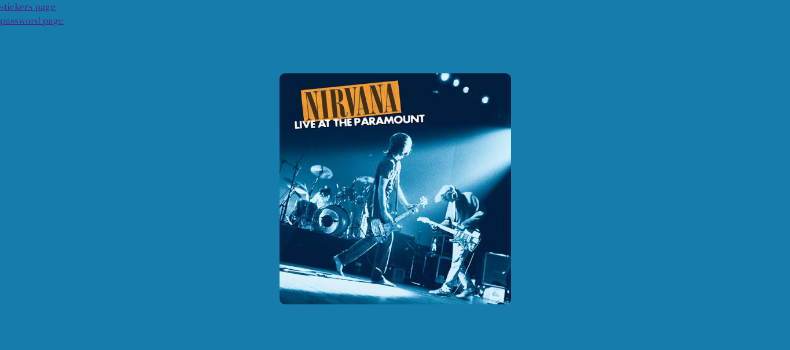

# Desafio 3.2 - Sitio Multipagina

Consiste en un sitio estatico de tres paginas que integra HTML, CSS y JavaScript con manipulacion del DOM, validacion de formularios y arquitectura de scripts compartida.

## Demo

Ver el proyecto en vivo: [Link de GitHub Pages](https://camlo77.github.io/Triple-javascript/)

## Capturas de pantalla

## Descripcion

El sitio cuenta con tres paginas interconectadas mediante enlaces de navegacion:

- **index.html**: pagina principal con una imagen interactiva que cambia de estilo al hacer click.
- **stickers.html**: pagina de "compra" de stickers con diez inputs numericos, cada uno limitado a un rango de 0 a 10, que calculan un total al presionar un boton.
- **password.html**: pagina con tres selectores desplegables que validan una combinacion de valores contra distintas "contraseñas" predefinidas.

## Funcionalidades

- Interaccion mediante eventos de click y validacion de valores ingresados por el usuario.
- Calculo dinamico de totales a partir de multiples campos numericos.
- Validacion de combinaciones de valores mediante selects.
- Arquitectura de JavaScript separada por pagina (`script.js`, `stickers.js`, `password.js`), evitando errores por referencias a elementos inexistentes entre paginas.
- Diseño responsivo basico con CSS Grid y Flexbox.
- Tipografia personalizada (Bodoni Moda) importada desde Google Fonts.
